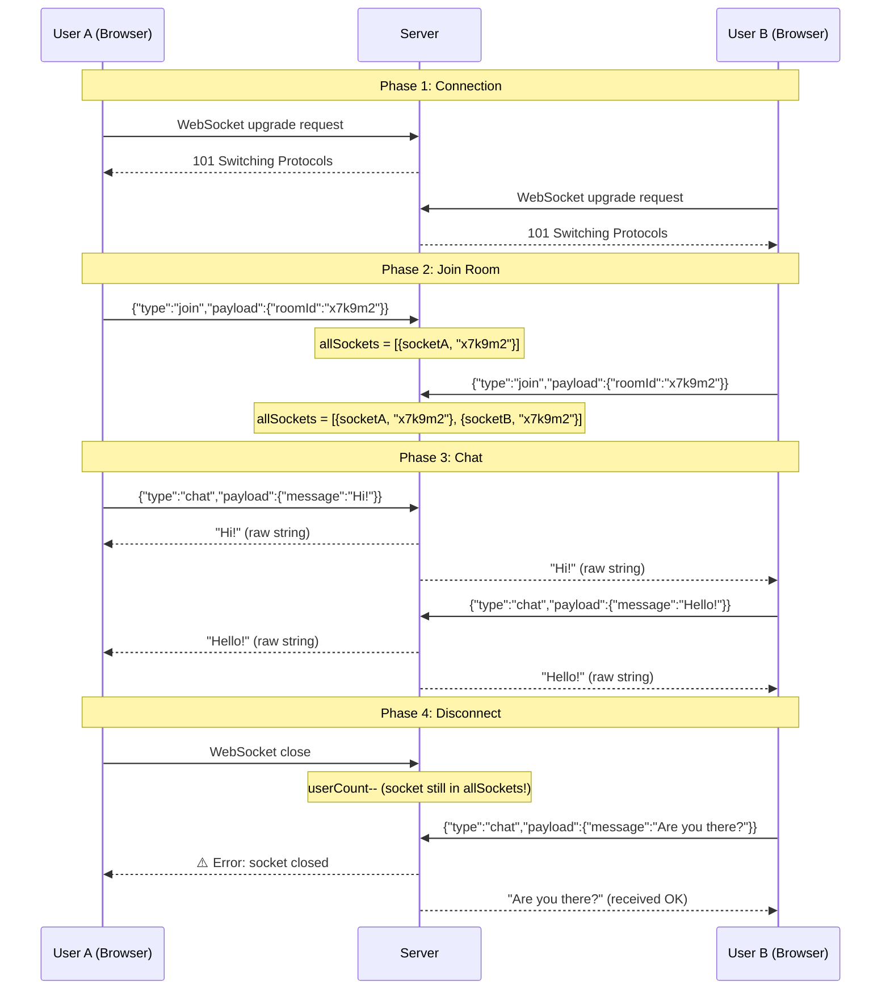

# API Reference — Chattr

## Overview

Chattr has a **minimal HTTP API**. The primary communication protocol is **WebSocket**, not REST. There is exactly **one** HTTP endpoint and two WebSocket message types.

---

## HTTP Endpoints

### `GET /ping`

Health check endpoint to verify the server is running.

| Field | Value |
|-------|-------|
| **Method** | `GET` |
| **URL** | `/ping` |
| **Full URL** | `https://chattr-0rux.onrender.com/ping` |
| **Purpose** | Health check / keep-alive for Render free tier |
| **Authentication** | None |
| **Rate Limiting** | None |
| **Headers** | None required |
| **Request Body** | None |
| **Response Status** | `200 OK` |
| **Response Content-Type** | `text/html; charset=utf-8` |
| **Response Body** | `Server is alive` |
| **Errors** | 503 if server is down |

#### Example Request

```bash
curl https://chattr-0rux.onrender.com/ping
```

#### Example Response

```
HTTP/1.1 200 OK
Content-Type: text/html; charset=utf-8

Server is alive
```

---

## WebSocket API

### Connection

| Field | Value |
|-------|-------|
| **Protocol** | WebSocket (ws:// or wss://) |
| **URL** | `wss://chattr-0rux.onrender.com` |
| **Subprotocol** | None |
| **Authentication** | None |
| **Headers** | Standard WebSocket upgrade headers |

#### Example Connection (JavaScript)

```javascript
const ws = new WebSocket("wss://chattr-0rux.onrender.com");

ws.onopen = () => {
  console.log("Connected");
};

ws.onmessage = (event) => {
  console.log("Received:", event.data);
};

ws.onclose = () => {
  console.log("Disconnected");
};
```

---

### WebSocket Message: `join`

Join a chat room. Must be sent after connection is established.

| Field | Value |
|-------|-------|
| **Direction** | Client → Server |
| **Purpose** | Register the connection with a specific room |
| **Authentication** | None |
| **Response** | None (silent) |

#### Request Payload

```json
{
  "type": "join",
  "payload": {
    "roomId": "abc123"
  }
}
```

| Field | Type | Required | Validation | Description |
|-------|------|----------|------------|-------------|
| `type` | `string` | Yes | Must be `"join"` | Message type discriminator |
| `payload.roomId` | `string` | Yes | None | Room identifier to join |

#### Server Behavior

1. Pushes `{ socket, roomId }` to the global `allSockets` array
2. No response is sent back to the client
3. No notification is sent to other room members
4. If the room doesn't exist, it's implicitly created
5. No validation on `roomId` format or length

#### Error Cases

| Scenario | Result |
|----------|--------|
| Missing `payload` | Crash — `TypeError: Cannot read properties of undefined` |
| Missing `payload.roomId` | `undefined` stored as roomId |
| Duplicate join (same socket, same room) | Duplicate entry in array (double messages) |
| Join different room (same socket) | Both entries exist; `find()` returns the first match |

#### Example

```javascript
ws.onopen = () => {
  ws.send(JSON.stringify({
    type: "join",
    payload: {
      roomId: "abc123"
    }
  }));
};
```

---

### WebSocket Message: `chat`

Send a message to all users in the same room.

| Field | Value |
|-------|-------|
| **Direction** | Client → Server → All Room Members |
| **Purpose** | Broadcast a chat message |
| **Authentication** | None |
| **Response** | Message broadcast to all room members (including sender) |

#### Request Payload

```json
{
  "type": "chat",
  "payload": {
    "message": "Hello, world!"
  }
}
```

| Field | Type | Required | Validation | Description |
|-------|------|----------|------------|-------------|
| `type` | `string` | Yes | Must be `"chat"` | Message type discriminator |
| `payload.message` | `string` | Yes | None | The message content |

#### Server Behavior

1. Finds the sender's `roomId` by matching the `socket` reference in `allSockets`
2. Iterates all entries in `allSockets`
3. Sends the raw message string to every socket with the matching `roomId`
4. The message is sent as a **plain string** (not JSON)

#### Broadcast Response (received by all room members)

```
Hello, world!
```

> **Note:** The server sends the **raw message text**, not a JSON envelope. There is no metadata (sender ID, timestamp, etc.).

#### Error Cases

| Scenario | Result |
|----------|--------|
| Sender not in any room (no `join` sent) | `currentUserRoom` is `undefined`; no messages sent |
| Missing `payload.message` | `undefined` sent to all room members |
| Message to closed socket | Uncaught error — `WebSocket is not open` |
| Empty string message | Empty string broadcast to room |

#### Example

```javascript
// Send a message
ws.send(JSON.stringify({
  type: "chat",
  payload: {
    message: "Hello everyone!"
  }
}));

// Receive messages
ws.onmessage = (event) => {
  console.log("Message:", event.data);
  // event.data is a plain string: "Hello everyone!"
};
```

---

## Complete API Flow Example



---

## API Limitations

1. **No REST API** — Only one GET endpoint for health check
2. **No JSON responses** from WebSocket — Messages are plain strings
3. **No message metadata** — No sender, no timestamp, no message ID
4. **No acknowledgments** — No delivery confirmation
5. **No pagination** — Not applicable (no persistence)
6. **No API versioning**
7. **No API documentation endpoint** (no Swagger/OpenAPI)
8. **No error responses** — Errors crash the handler silently
