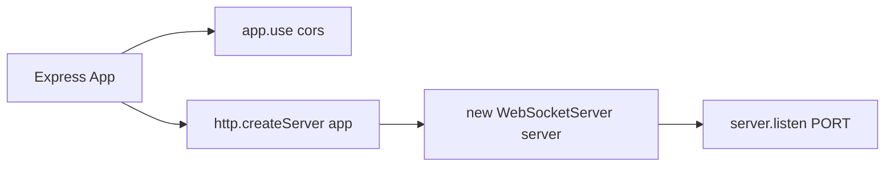
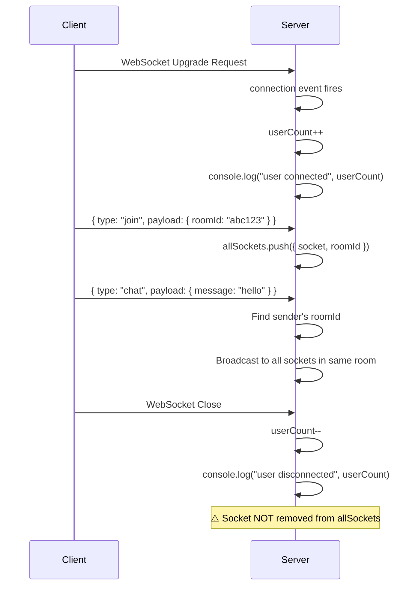

# Backend Documentation — Chattr

## Architecture

The entire backend is a **single file** (`server/src/index.ts`, 79 lines) that combines:

1. An **Express HTTP server** (used solely for a health check endpoint)
2. A **native WebSocket server** (`ws` library) attached to the HTTP server
3. **In-memory room management** using a simple array of socket-room mappings

There is **no database**, **no authentication**, **no middleware stack**, **no controllers**, **no services**, **no models**, and **no routes** beyond a single health check.

---

## Server Setup

```typescript
import { WebSocketServer, WebSocket } from "ws";
import express from "express";
import cors from "cors";
import http from "http";

const app = express();
app.use(cors());

const server = http.createServer(app);
const ws = new WebSocketServer({ server });
```

### Initialization Flow



1. Express app created
2. CORS middleware applied (allows ALL origins — no restrictions)
3. HTTP server wraps Express app
4. WebSocket server attaches to the HTTP server (shares the same port)
5. Server listens on `process.env.PORT || 3000`

---

## HTTP Endpoints

There is exactly **one** HTTP endpoint:

### `GET /ping`

| Field | Value |
|-------|-------|
| Method | `GET` |
| URL | `/ping` |
| Purpose | Health check / keep-alive |
| Authentication | None |
| Request Body | None |
| Response Status | `200 OK` |
| Response Body | `"Server is alive"` (plain text) |

**Usage:** This endpoint exists to verify the server is running. On Render's free tier, services spin down after inactivity — this endpoint can be pinged to keep the server alive.

---

## Data Structures

### `User` Interface

```typescript
interface User {
  socket: WebSocket;
  roomId: string;
}
```

### Global State

```typescript
let userCount: number = 0;       // Total connected WebSocket clients
let allSockets: User[] = [];     // All connected users with their room assignments
```

> **Critical Issue:** `allSockets` is a **module-level mutable array**. This means:
> - It grows with every connection but **users are never removed** from it on disconnect (the `close` handler only decrements `userCount`)
> - This is a **memory leak** — the array will grow unboundedly
> - Disconnected sockets remain in the array, and the server will attempt to send messages to them

---

## WebSocket Protocol

### Connection Lifecycle



### Message Types

#### 1. `join` — Join a Room

**Client sends:**
```json
{
  "type": "join",
  "payload": {
    "roomId": "abc123"
  }
}
```

**Server behavior:**
```typescript
allSockets.push({ socket, roomId: parsedMessage.payload.roomId });
```

- Adds the socket-room mapping to the global array
- **No validation** on roomId format
- **No room existence check** — joining creates the room implicitly
- **No user limit per room** — unlimited users can join any room
- A single socket can send multiple `join` messages, resulting in **duplicate entries** in `allSockets`

#### 2. `chat` — Send a Message

**Client sends:**
```json
{
  "type": "chat",
  "payload": {
    "message": "hello"
  }
}
```

**Server behavior:**
```typescript
const currentUserRoom = allSockets.find(
  (x) => x.socket == socket
)?.roomId;

allSockets.forEach((user) => {
  if (user.roomId === currentUserRoom) {
    user.socket.send(parsedMessage.payload.message);
  }
});
```

- Finds the sender's room by matching the WebSocket reference
- Broadcasts the message to **all** sockets in the same room (including the sender)
- Sends the raw message string (not a JSON envelope)
- **No sender identification** — receivers cannot distinguish who sent the message
- Uses `==` instead of `===` for socket comparison (works because it's object reference equality, but not idiomatic)

### Connection Close

```typescript
socket.on("close", () => {
  console.log("user disconnected");
  userCount = userCount - 1;
  console.log(userCount);
});
```

**Critical Issues:**
1. **Socket is NOT removed from `allSockets`** — This is a memory leak and will cause errors when trying to send messages to closed sockets
2. **No room cleanup** — Empty rooms are never detected or cleaned up
3. **No notification** — Other users in the room are not notified when someone leaves
4. **`userCount` can go negative** — If a socket disconnects without ever being counted (edge case)

---

## Error Handling

**The backend has essentially no error handling:**

| Scenario | Handling |
|----------|----------|
| Malformed JSON message | ❌ `JSON.parse` will throw, crashing the handler |
| Unknown message type | ❌ Silently ignored (no `else` clause) |
| Sending to closed socket | ❌ `socket.send()` on closed socket will throw |
| WebSocket upgrade failure | ❌ No handling |
| Server crash | ❌ No process manager (no PM2, no cluster) |
| Missing `roomId` in join | ❌ Will push `undefined` as roomId |
| Missing `message` in chat | ❌ Will send `undefined` to all room members |

---

## Express Configuration

| Setting | Value | Notes |
|---------|-------|-------|
| CORS | `cors()` — all origins allowed | No origin restrictions |
| Body parsing | Not configured | Not needed (no POST endpoints) |
| Static files | Not configured | Not applicable |
| Rate limiting | Not configured | No protection against abuse |
| Helmet | Not configured | No security headers |
| Logging | `console.log` only | No structured logging |
| Error middleware | Not configured | No centralized error handler |

---

## Environment Variables

| Variable | Default | Used For |
|----------|---------|----------|
| `PORT` | `3000` | Server listen port |

That's the **only** environment variable. There are no secrets, no API keys, no database URLs.

---

## Installed but Unused Dependencies

### `jsonwebtoken` (v9.0.2)

This package is **installed in `package.json`** but is **never imported or used** anywhere in the codebase. It was likely added with the intention of implementing authentication but was never utilized.

### `http` (v0.0.1-security)

The `http` package is installed as a dependency, but this is the **built-in Node.js `http` module**. The npm package `http@0.0.1-security` is a security placeholder that redirects to the built-in module. It's unnecessary to list this as a dependency — the built-in module works without installation.

### `@types/cors`, `@types/express`, `@types/ws`

These are TypeScript type definitions. They are correctly listed as dependencies (not devDependencies), which is a common practice in projects deployed with TypeScript compilation, though they should ideally be in `devDependencies`.

---

## Build System

### NPM Scripts

| Script | Command | Purpose |
|--------|---------|---------|
| `dev` | `tsc -b && node dist/index.js` | Compile TypeScript then run |
| `test` | `echo "Error: no test specified" && exit 1` | Placeholder (no tests) |

**Issues:**
- No `start` script for production
- No `build` script (only `dev` compiles)
- No watch mode (`tsc --watch` or `nodemon`)
- No hot-reloading during development

### TypeScript Configuration

| Setting | Value |
|---------|-------|
| Target | ES2016 |
| Module | CommonJS |
| Root Dir | `./src` |
| Out Dir | `./dist` |
| Strict | true |
| esModuleInterop | true |
| skipLibCheck | true |

---

## What's NOT Present

The backend does **not** have:

- Database (no MongoDB, no PostgreSQL, no SQLite)
- ORM/ODM (no Prisma, no Mongoose, no Sequelize)
- Authentication / Authorization
- Rate limiting
- Input validation / sanitization
- Structured logging (no Winston, no Pino)
- Error handling middleware
- Request/response typing
- API versioning
- Tests
- Docker configuration
- Health check beyond `/ping`
- Graceful shutdown handling
- Process manager (PM2, forever, etc.)
- WebSocket heartbeat/ping-pong
- Room size limits
- Message size limits
- Message format validation
- User identification
- Connection timeout handling
