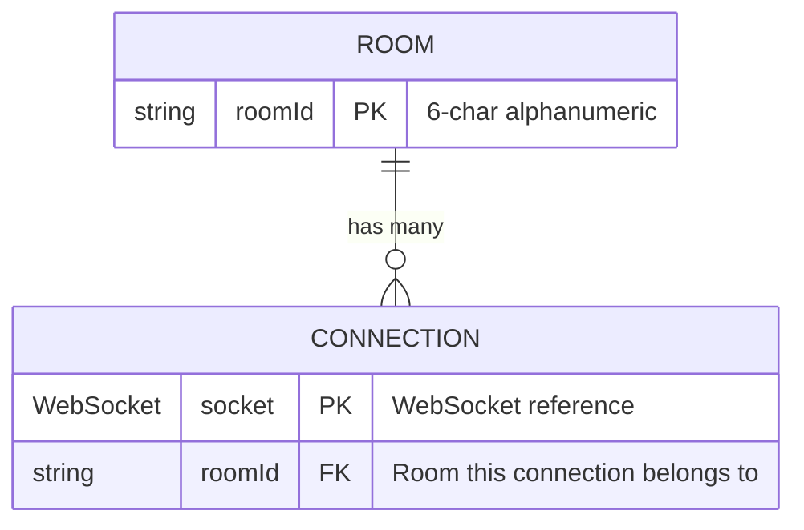
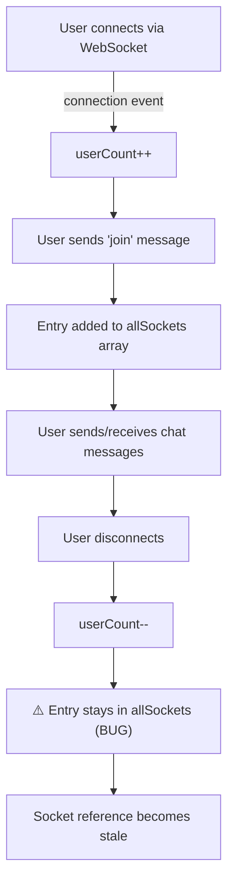
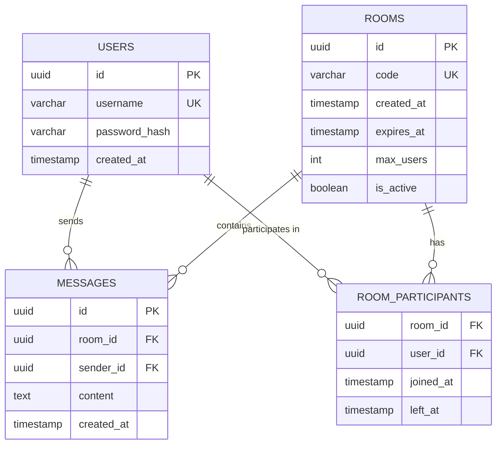

# Database Documentation — Chattr

## Overview

**Chattr has NO database.**

This is a deliberate design decision. The application's core principle is "Chat Without a Footprint" — no messages, user data, or session information is ever persisted to any storage system.

---

## Data Storage Architecture

All data exists exclusively in **server process memory** and is lost when:

- The server process restarts
- The server crashes
- The deployment platform recycles the instance (Render's free tier spins down after 15 minutes of inactivity)

### In-Memory Data Structures

```typescript
// Global mutable state (server/src/index.ts)
let userCount: number = 0;       // Total connected users (counter)
let allSockets: User[] = [];     // Socket-to-room mapping array

interface User {
  socket: WebSocket;   // Active WebSocket connection reference
  roomId: string;      // Room identifier this socket belongs to
}
```

### Conceptual Schema

If this were modeled as a database, the structure would be:



But in reality, there is no `ROOM` entity — rooms are implicitly created when the first user joins and implicitly "exist" as long as any entry in `allSockets` references that `roomId`.

### Data Lifecycle



---

## What Would Be Needed for a Database

If the project were to add persistence, the recommended schema would be:

### Tables / Collections

#### `rooms`

| Column | Type | Constraints | Description |
|--------|------|-------------|-------------|
| `id` | UUID | PRIMARY KEY | Unique room identifier |
| `code` | VARCHAR(6) | UNIQUE, NOT NULL | 6-char join code |
| `created_at` | TIMESTAMP | NOT NULL, DEFAULT NOW | Room creation time |
| `expires_at` | TIMESTAMP | NULLABLE | Optional expiry for auto-cleanup |
| `max_users` | INTEGER | DEFAULT 2 | Maximum participants |
| `is_active` | BOOLEAN | DEFAULT true | Whether room is currently active |

#### `users` (optional, if adding accounts)

| Column | Type | Constraints | Description |
|--------|------|-------------|-------------|
| `id` | UUID | PRIMARY KEY | Unique user identifier |
| `username` | VARCHAR(30) | UNIQUE, NOT NULL | Display name |
| `password_hash` | VARCHAR(255) | NOT NULL | Bcrypt hash |
| `created_at` | TIMESTAMP | NOT NULL | Registration time |

#### `messages` (optional, if adding persistence)

| Column | Type | Constraints | Description |
|--------|------|-------------|-------------|
| `id` | UUID | PRIMARY KEY | Message identifier |
| `room_id` | UUID | FOREIGN KEY → rooms.id | Room this message belongs to |
| `sender_id` | UUID | FOREIGN KEY → users.id (nullable) | Who sent it |
| `content` | TEXT | NOT NULL | Message content |
| `created_at` | TIMESTAMP | NOT NULL | When sent |

#### `room_participants`

| Column | Type | Constraints | Description |
|--------|------|-------------|-------------|
| `room_id` | UUID | FOREIGN KEY → rooms.id | Room reference |
| `user_id` | UUID | FOREIGN KEY → users.id | User reference |
| `joined_at` | TIMESTAMP | NOT NULL | When they joined |
| `left_at` | TIMESTAMP | NULLABLE | When they left |

### ER Diagram (Hypothetical)



---

## ORM / Migration Tools

**None are present.** The project uses:

- No Prisma
- No Mongoose
- No Sequelize
- No TypeORM
- No Drizzle
- No Knex
- No migration files
- No seed files

---

## Implications

1. **No data recovery** — If the server crashes mid-conversation, all messages are permanently lost
2. **No analytics** — No way to track usage patterns, room creation rates, or message volumes
3. **No moderation** — No way to review or moderate content after the fact
4. **No horizontal scaling** — Since rooms exist only in one process's memory, running multiple server instances would create separate, disconnected room pools. A Redis pub/sub layer would be needed.
5. **Privacy advantage** — The absence of a database means there is genuinely nothing to subpoena, hack, or leak (though messages are transmitted in plaintext over WebSocket)
