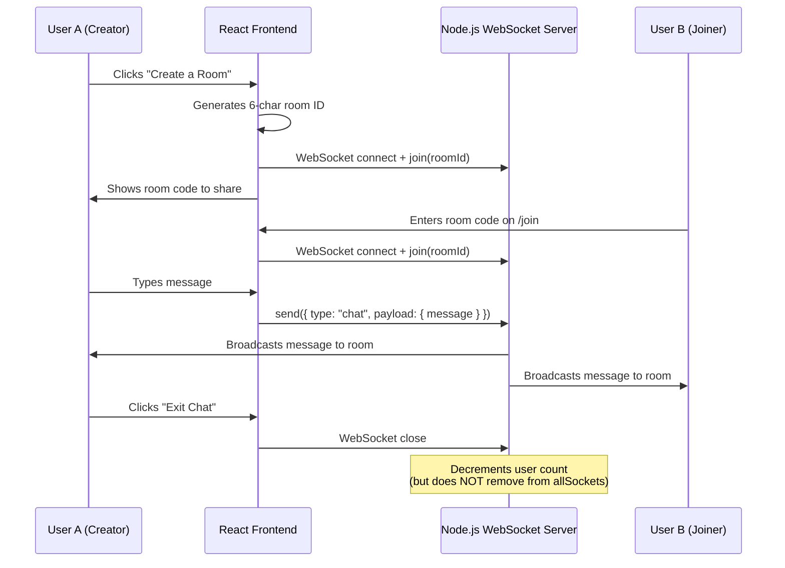

# Project Overview — Chattr

## Summary

**Chattr** is an anonymous, ephemeral chat application that allows users to create or join temporary chat rooms using a 6-character room code. All conversations are real-time (via WebSockets), and **no messages are ever persisted to a database**. When all users leave a room, the conversation is lost permanently.

The project tagline: _"Chat Without a Footprint"_

## Live Deployment

| Component | Platform | URL |
|-----------|----------|-----|
| Frontend  | Vercel   | [https://chattr-orpin.vercel.app/](https://chattr-orpin.vercel.app/) |
| Backend   | Render   | `wss://chattr-0rux.onrender.com` |

## Core Concept

Chattr is designed around a single, privacy-first principle: **zero data persistence**. There is:

- **No database** — messages exist only in server memory during an active WebSocket session
- **No authentication** — users are completely anonymous
- **No user accounts** — no signup, no login, no profiles
- **No message history** — closing the chat destroys the conversation
- **No logging** — no messages are written to any persistent store

## How It Works (High-Level)

## Tech Stack

### Frontend

| Technology | Version | Purpose |
|------------|---------|---------|
| React | 18.3.1 | UI framework |
| TypeScript | ~5.6.2 | Type safety |
| Vite | 6.0.3 | Build tool & dev server |
| Tailwind CSS | 3.4.17 | Utility-first CSS |
| React Router DOM | 7.1.1 | Client-side routing |
| Framer Motion | 11.15.0 | Animations |
| react-icons | 5.4.0 | Icon library |
| clsx + tailwind-merge | 2.1.1 / 2.6.0 | Conditional CSS class merging |

### Backend

| Technology | Version | Purpose |
|------------|---------|---------|
| Node.js | — | Runtime |
| TypeScript | 5.7.2 | Type safety |
| Express | 4.21.2 | HTTP server (health check only) |
| ws | 8.18.0 | Native WebSocket server |
| cors | 2.8.5 | Cross-Origin Resource Sharing |
| jsonwebtoken | 9.0.2 | **Installed but NOT used** |

## Architecture Pattern

This project follows a **minimal, serverless-database architecture**:

- **Frontend**: Single Page Application (SPA) with client-side routing
- **Backend**: Stateful WebSocket server with in-memory room management
- **Communication**: Raw WebSocket protocol (native `ws` library, NOT Socket.IO)
- **Data Storage**: None — purely in-memory
- **Authentication**: None

## Key Design Decisions

1. **`ws` instead of Socket.IO** — Uses the raw WebSocket protocol for minimal overhead. This means no automatic reconnection, no rooms abstraction, no event namespacing, and no fallback to long-polling.

2. **No Database** — By design, to fulfill the "no footprint" promise. This means the application cannot scale horizontally without additional infrastructure (e.g., Redis pub/sub).

3. **No Authentication** — Users are entirely anonymous. There is no way to distinguish "self" messages from "other" messages in the current implementation.

4. **Room ID Generation** — Room IDs are generated client-side using `Math.random().toString(36).substring(2, 8)`, producing a 6-character alphanumeric string. This is not cryptographically secure.

5. **Monorepo Structure** — Client and server are in the same repository but are independently deployable with separate `package.json` files and no shared code.

## Project Maturity

This is an **MVP / proof-of-concept** application. It demonstrates the core concept of ephemeral anonymous chat but lacks many features expected in a production chat application (see [MISSING_FEATURES.md](./MISSING_FEATURES.md)).

## Author

- **tanishkadeep** — [Portfolio](https://tanishka-deep.vercel.app/) | [Email](mailto:tanishkadeep09@gmail.com)
