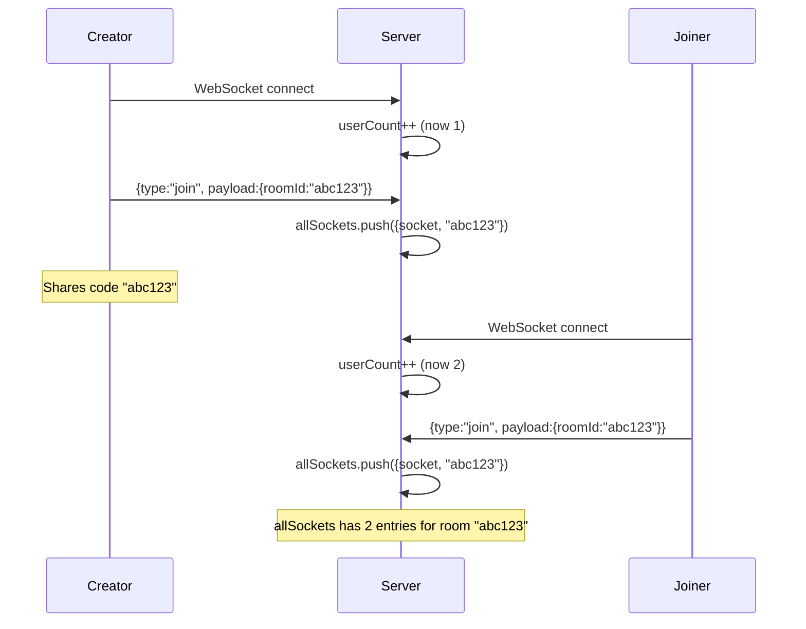
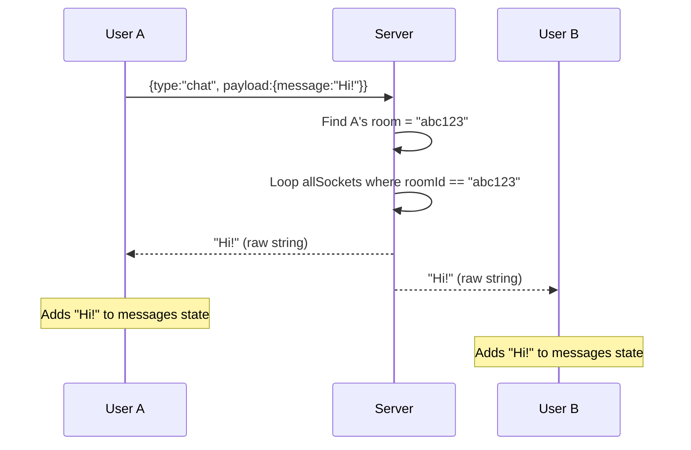
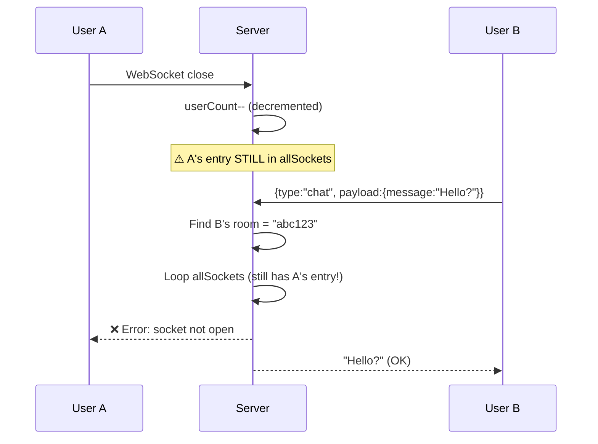

# WebSocket / Socket Events — Chattr

## Overview

Chattr uses the **native WebSocket API** (via the `ws` npm package on the server and the browser's built-in `WebSocket` on the client). This is **NOT Socket.IO** — there are no namespaces, rooms abstraction, automatic reconnection, or event names. Communication is done via raw JSON string messages.

---

## Protocol

| Property | Value |
|----------|-------|
| Library (Server) | `ws` v8.18.0 |
| Library (Client) | Native browser `WebSocket` API |
| Transport | WebSocket (RFC 6455) |
| URL | `wss://chattr-0rux.onrender.com` |
| Subprotocol | None |
| Serialization | JSON (stringified) |
| Authentication | None |
| Heartbeat/Ping | None |
| Reconnection | None |

---

## Client → Server Events

### Event: `join`

| Property | Value |
|----------|-------|
| When Sent | Immediately after WebSocket `open` event |
| Frequency | Once per connection |
| Purpose | Register this connection with a chat room |

**Payload:**

```json
{
  "type": "join",
  "payload": {
    "roomId": "x7k9m2"
  }
}
```

**Fields:**

| Field | Type | Required | Description |
|-------|------|----------|-------------|
| `type` | `"join"` | Yes | Discriminator |
| `payload.roomId` | `string` | Yes | 6-char room identifier |

**Server Handler Logic:**

```typescript
if (parsedMessage.type === "join") {
  allSockets.push({ socket, roomId: parsedMessage.payload.roomId });
}
```

**Side Effects:**
- Adds entry to `allSockets` array
- No response sent to client
- No notification to other room members

**Client Code (Chat.tsx, lines 42–51):**

```typescript
ws.onopen = () => {
  ws.send(
    JSON.stringify({
      type: "join",
      payload: {
        roomId,
      },
    })
  );
};
```

---

### Event: `chat`

| Property | Value |
|----------|-------|
| When Sent | When user submits the message form |
| Frequency | Per message sent |
| Purpose | Send a chat message to the room |

**Payload:**

```json
{
  "type": "chat",
  "payload": {
    "message": "Hello, world!"
  }
}
```

**Fields:**

| Field | Type | Required | Description |
|-------|------|----------|-------------|
| `type` | `"chat"` | Yes | Discriminator |
| `payload.message` | `string` | Yes | Message content |

**Server Handler Logic:**

```typescript
if (parsedMessage.type === "chat") {
  const currentUserRoom = allSockets.find(
    (x) => x.socket == socket
  )?.roomId;

  allSockets.forEach((user) => {
    if (user.roomId === currentUserRoom) {
      user.socket.send(parsedMessage.payload.message);
    }
  });
}
```

**Side Effects:**
- Broadcasts raw message string to ALL sockets in the same room
- Includes the sender (echo back)
- No acknowledgment sent

**Client Code (Chat.tsx, lines 64–72):**

```typescript
if (message && wsRef.current) {
  wsRef.current.send(
    JSON.stringify({
      type: "chat",
      payload: {
        message: message,
      },
    })
  );
}
```

---

## Server → Client Events

### Event: Message Broadcast

| Property | Value |
|----------|-------|
| When Sent | After server receives a `chat` message |
| Recipients | All sockets in the same room (including sender) |
| Format | **Raw string** (NOT JSON) |

**Payload:**

```
Hello, world!
```

> **Important:** The server does NOT wrap the message in a JSON envelope. It sends `parsedMessage.payload.message` directly as a raw string.

**Client Handler (Chat.tsx, lines 31–33):**

```typescript
ws.onmessage = (event) => {
  setMessages((m) => [...m, event.data]);
};
```

- `event.data` is a plain string
- Appended to the `messages` state array
- Triggers re-render

---

## Server Lifecycle Events

### `connection`

Fired when a new WebSocket client connects.

```typescript
ws.on("connection", function connection(socket: WebSocket) {
  console.log("user connected");
  userCount = userCount + 1;
  console.log(userCount);
  // ... set up message and close handlers
});
```

### `close`

Fired when a WebSocket client disconnects.

```typescript
socket.on("close", () => {
  console.log("user disconnected");
  userCount = userCount - 1;
  console.log(userCount);
});
```

> ⚠️ **Bug:** The `close` handler does NOT remove the socket from `allSockets`.

---

## Event Flow Diagrams

### Room Creation & Joining Flow



### Message Exchange Flow



### Disconnect Flow (showing bug)



---

## Summary Table

| Direction | Type | Payload Format | Purpose |
|-----------|------|----------------|---------|
| Client → Server | `join` | JSON `{type, payload: {roomId}}` | Register with room |
| Client → Server | `chat` | JSON `{type, payload: {message}}` | Send message |
| Server → Client | (broadcast) | Raw string | Deliver message |

---

## Missing Socket Events

The following events are commonly expected in chat applications but are **NOT implemented**:

| Event | Purpose |
|-------|---------|
| `leave` | Explicitly leave a room |
| `typing` | Indicate user is typing |
| `user_joined` | Notify room when someone joins |
| `user_left` | Notify room when someone leaves |
| `error` | Server-side error notification |
| `room_info` | Room metadata (user count, etc.) |
| `ping/pong` | Connection keep-alive |
| `reconnect` | Re-establish session after disconnect |
| `read_receipt` | Message delivery/read confirmation |
